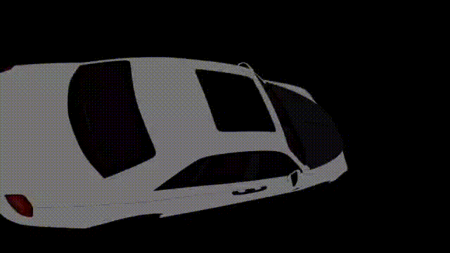

Our First ever react app\
check it out at [https://monza-motors.netlify.app/](https://monza-motors.netlify.app/)\
Yes it isn't of much quality but we made it as a joke under highly non-ideal circumstances.

# Monza Motors
Monza Motors is a React-based web application designed to showcase a fictional car dealership. The app features a modern, responsive design and includes various components such as a navigation bar, car listings, a 3D car customizer, and most importantly, a footer. - Gpt4o



My first attempt at the 3d customiser, we all start somewhere (⌒_⌒;) - [@nithitsuki](https://github.com/nithitsuki) 

## Lessons Learned Since:
 - use Next.js to bootstrap a react app
 - use Tailwind CSS to style the app
 - ~~Steal~~ Use components from others
 - ShadCn, Origin UI, Reactbits goated

## run locally
```bash
git clone https://github.com/Einheit-Zenkai/monza-motors
cd monza-motors
pnpm install
pnpm dev
```

## test if it builds
```bash
pnpm build
```